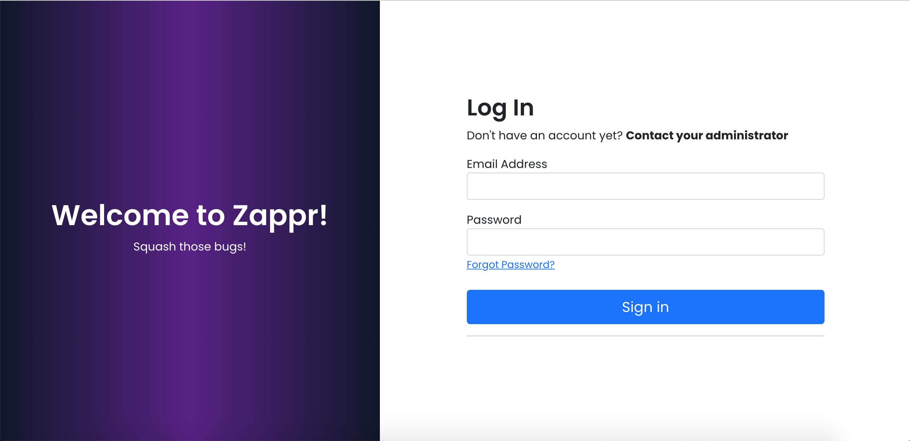
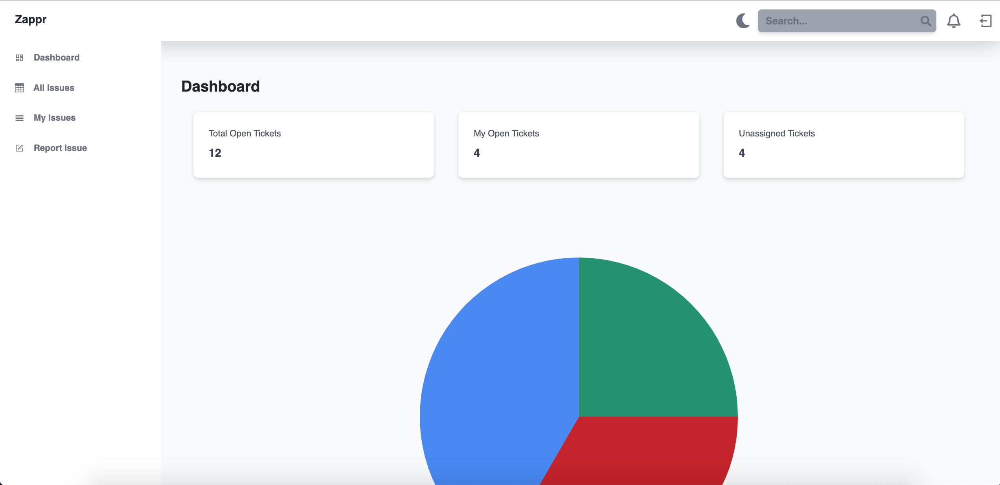
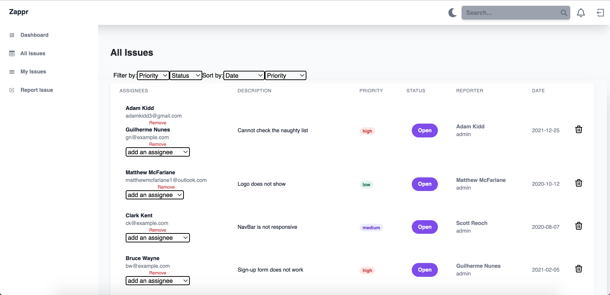
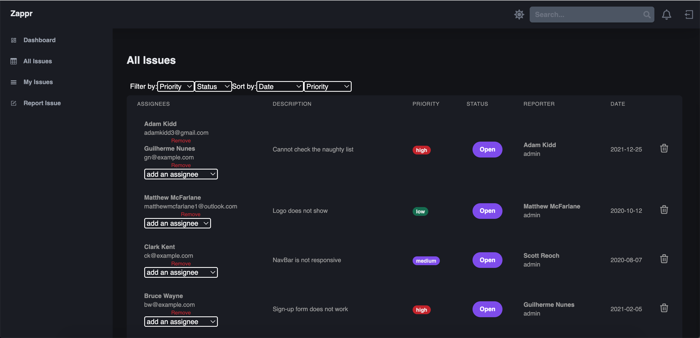
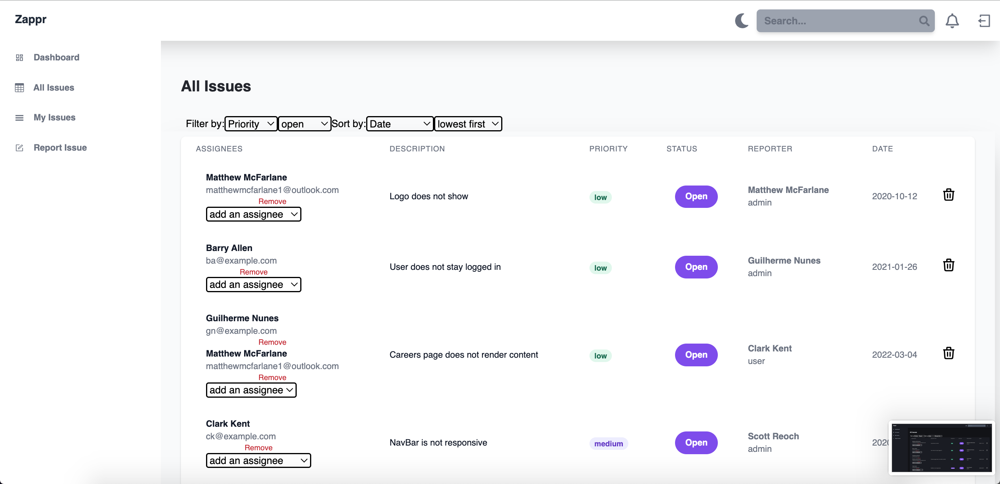
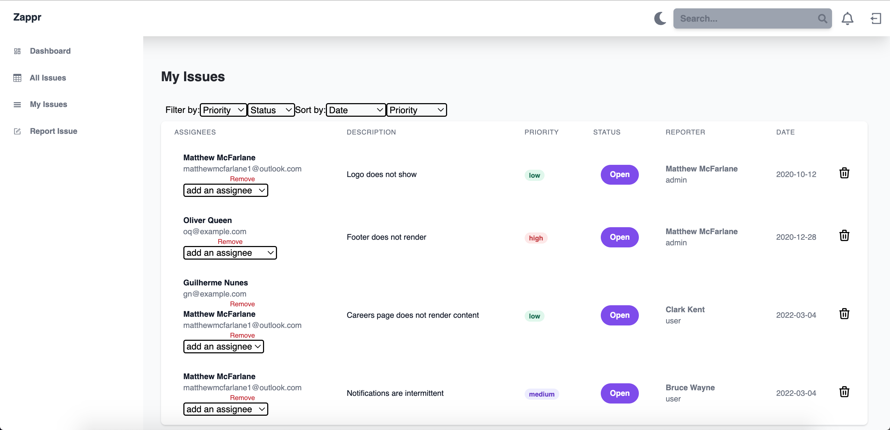
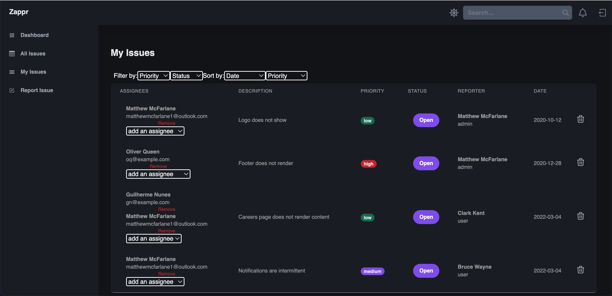
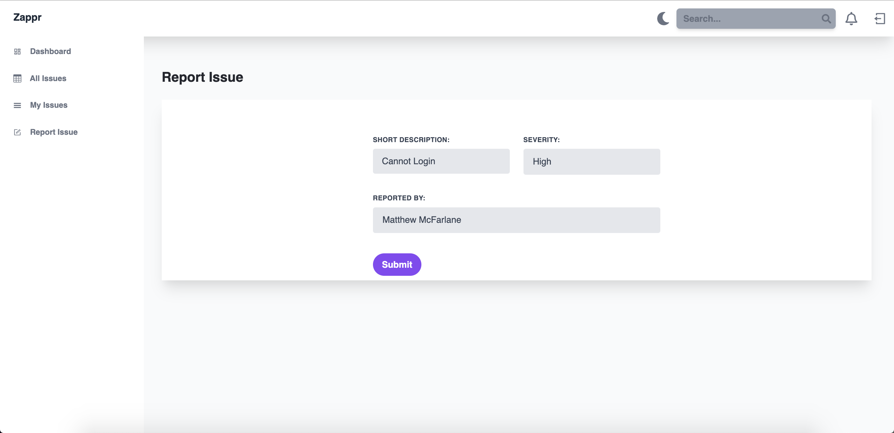
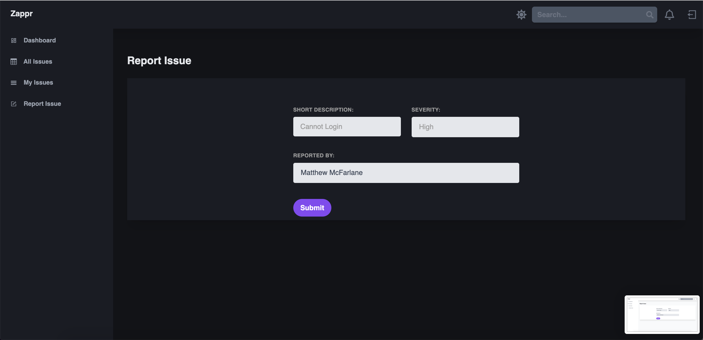

# Zappr (Bug Tracker)
The bug tracker app allows a team to track any known bugs. Bugs are reported and then assigned to either one or multiple team members. When reporting a bug, they are timestamped and the priority can be set as either low, medium or high, with a description.

Bugs can be filtered via priority or status (open/closed), sorted via date or status(open/closed), or a combination of both. Once a bug is resolved, the status can be toggled as closed or deleted from the database. 

Users can track 'my issues' which will display any bugs assigned to them or reported by them.

Users can log in to the app after they are registered by the administrator. Authentication and authorisation are implemented using Auth0.

Once a user is registered and assigned a role by the admin using Auth0, they are able to log in. On login, there is a check which determines if a user is present on the database via their Auth0sub (Unique ID obtained after authentication), if they are not, they are added to the database.

Users can toggle between light mode and dark mode.

This app was built using ReactJS, Java, Spring, H2, TailwindCSS and Auth0.

## Screenshots

Login Page

Dashboard

All Issues

All Issues - Filtered and Sorted

My Issues

Report Issue

## MVP

- Implement Authentinction and Authorisation.

A user should be able to:

- Report a new bug.
- Assign a bug to one or multiple users.
- View all bugs.
- View bugs reported by and assigned to self.
- Mark bugs as open/closed
- Delete bugs

## Extensions

- Light and Dark mode
- Sorts/Filters

## Further Work

- Tidy up the repo (Split up components etc.)
- Improve colour scheme

## The project is built using:
* ReactJS (https://reactjs.org/)
* Java (https://www.java.com/en/)
* Spring (https://spring.io/)
* H2 (https://www.h2database.com/html/main.html)
* TailwindCSS (https://tailwindcss.com/)
* Auth0 (https://auth0.com/)

## Project set up

| Front-end (client) | Back-end (server)    |
| :---               | :---                 |
| `npm install`      |  `Open project with IDE such as InteliJ`|                               
| `npm start`        |  `Run BugTrackerApplication` |

Navigate to localhost:3000/
In order to login, a demo account has been created. The credentials are:

Email: IssueTrackerDemoUser@gmail.com

Password: DemoAccount2022!
